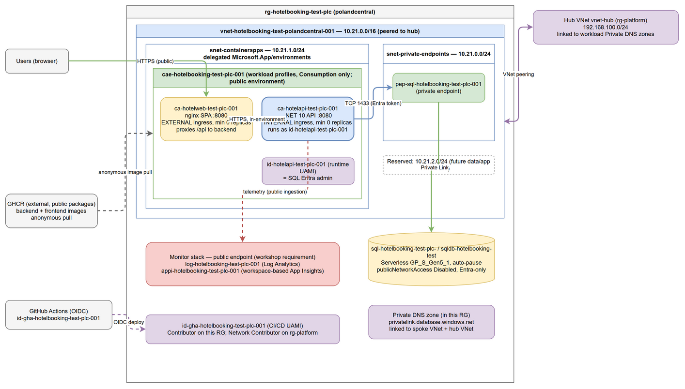
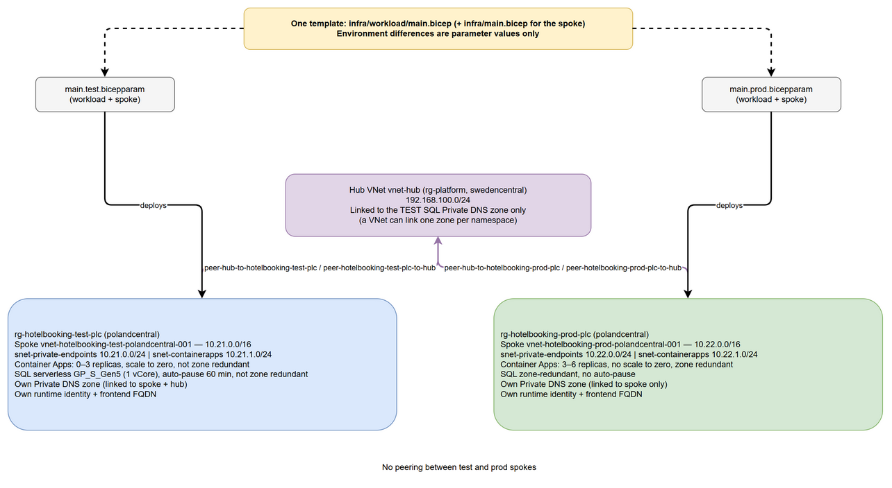

# HotelBooking — infrastructure design (`test` detail; `prod` in section 8)

Design only (no Bicep). It is detailed enough for a follow-up implementation to build without
re-opening architectural questions. Pillar tags: **R**eliability, **S**ecurity, **C**ost,
**O**perations, **P**erformance.

Source: [architecture-test.drawio](architecture-test.drawio) (the PNG embeds the editable XML).

## 1. Workload analysis (from `workload-app/`, read-only)

| Area | Finding |
| --- | --- |
| Backend | ASP.NET Core minimal API on **.NET 10** (`HotelBooking.Api`), listens on **8080** (`ASPNETCORE_HTTP_PORTS`), runs as non-root. |
| Endpoints | `GET /api/hotels`, `/api/hotels/{id}`, `/api/hotels/{id}/rooms`; `POST /api/bookings`, `GET /api/bookings/{id}`, `GET /api/bookings/by-email/{email}`, `DELETE /api/bookings/{id}`; `/openapi`. No auth on any endpoint. |
| Frontend | Vite/React SPA built to static files, served by **nginx on 8080** (non-root). The SPA calls the relative path `/api`; nginx reverse-proxies `/api/` to `BACKEND_URL`. |
| Frontend config | `BACKEND_URL` env var (validated by the entrypoint: `http(s)://host[:port]` only, no path) is substituted into the nginx template at start. |
| Data store | **SQL Server** via EF Core. Connection string `ConnectionStrings:HotelDb` (env var `ConnectionStrings__HotelDb`). On startup the API runs `EnsureCreated` and seeds hotels if empty, so the schema owner is the identity the API runs as. |
| Authentication | None for end users. Service-to-service auth is only the SQL connection (`Authentication=Active Directory Default` supported). |
| Telemetry | Backend enables Azure Monitor OpenTelemetry only if `APPLICATIONINSIGHTS_CONNECTION_STRING` is set. The SPA's OTLP exporter targets `/otel`, which nginx does not proxy; browser telemetry is **out of scope** here (no new route is designed for it). |
| Images | Prebuilt, public GHCR packages (backend + frontend). No ACR. |

## 2. Decisions

| # | Decision | Rationale |
| --- | --- | --- |
| D1 | **Azure Container Apps**, one environment, **workload profiles v2, Consumption profile only**, VNet-integrated. | C/O: scale-to-zero, no cluster to run. S: managed identity, VNet integration, internal ingress. |
| D2 | Frontend app: **external ingress**, min replicas 0. Backend app: **internal ingress**, min replicas 0. | S: frontend is the only public workload surface; the API is never directly internet-reachable. C: both idle at zero. |
| D3 | Frontend reaches backend via nginx `/api/` proxy to the backend's **internal HTTPS FQDN** (`BACKEND_URL=https://ca-hotelapi-test-plc-001.internal.<environment-default-domain>`, taken from the environment's `defaultDomain` output); `allowInsecure` stays `false`. | S: encrypted in transit even inside the environment. The entrypoint accepts a host-only HTTPS URL, so no app change. Implementation verifies nginx trusts the environment certificate; if it does not, fall back to HTTP on the internal name with `allowInsecure: true` as a recorded `test`-only exception. |
| D4 | **Azure SQL** logical server + **serverless** database (`GP_S_Gen5_1`, auto-pause 60 min, min vCores 0.5), Entra-only auth, `publicNetworkAccess: Disabled`, **private endpoint** in `snet-private-endpoints`. | S: private-only. C: serverless auto-pause fits scale-to-zero (first request after a pause takes extra seconds to resume; accepted for `test`). R: zone redundancy off in `test`. |
| D5 | SQL Entra admin = **runtime UAMI** `id-hotelapi-test-plc-001` (`principalType: Application`, `sid` = principalId, Entra-only). | S/O: passwordless; the app can create/seed the schema at startup. *Workshop simplification:* production would use an Entra group as admin and a least-privilege contained user for the app. |
| D6 | Connection string built at deploy time: `Server=tcp:<sql-fqdn>,1433;Database=sqldb-hotelbooking-test;Authentication=Active Directory Default;Encrypt=True;` plus `AZURE_CLIENT_ID` = runtime UAMI clientId. No password, no secret. | S: identity is the only credential. |
| D7 | **Monitor stack public**: Log Analytics + workspace-based Application Insights, with no private networking. The App Insights connection string is an ingestion locator, not a credential, and is passed as a plain env var to the backend. | Workshop requirement; O: simple telemetry path. |
| D8 | **Images from public GHCR**, anonymous pull, referenced by commit-SHA tag (not `latest`) via a deploy parameter. No `registries[]`, no ACR, no pull credentials. | S: nothing to leak. R: SHA tags give reproducible rollbacks. |
| D9 | **Private DNS**: `privatelink.database.windows.net` zone **in `rg-hotelbooking-test-plc`**, linked to the spoke VNet **and** the hub VNet, with a zone group on the SQL private endpoint. | S/O: distributed DNS model; the spoke link makes the Container Apps resolve the private IP, the hub link serves hub-side clients. |
| D10 | Network: spoke `10.21.0.0/16` (peered to hub `192.168.100.0/24`). `snet-private-endpoints` `10.21.0.0/24` and `snet-containerapps` `10.21.1.0/24` (delegated to `Microsoft.App/environments`); `10.21.2.0/24` is reserved. | R: headroom. Workload profiles need at least a /27; a /24 avoids re-IP later. |
| D15 | Spoke in **Poland Central**, hub stays in **Sweden Central**: the VNet peering is global (cross-region). | R/C: placed where capacity is available; cross-region peering adds inter-region data-transfer cost and latency on spoke-to-hub traffic only. |
| D11 | **No Key Vault, Storage, or App Configuration** in `test`: the app has no secrets and no blobs. | C/S: smaller surface; add only when a requirement appears. |
| D12 | **Two identities per environment, deliberately separate** (see section 4). | S: least privilege; the runtime identity cannot redeploy and the CI identity has no data-plane rights. |
| D13 | Scale rules: HTTP concurrency rule, min 0, max 3 (frontend) / max 3 (backend); 0.5 vCPU / 1 GiB each. | C/P: modest ceiling, cold start accepted in `test`. |
| D14 | Health probes: backend: TCP probe on 8080 for liveness and HTTP `GET /openapi/v1.json` for readiness (neither touches SQL); frontend: HTTP `GET /` on 8080. | R: avoids restarting the API merely because SQL is resuming. |

### Alternatives considered (compute)

| Option | Verdict |
| --- | --- |
| **Container Apps (chosen)** | Scale-to-zero, VNet + internal ingress, UAMI, per-app ingress exposure, low ops. |
| App Service for Containers | No scale-to-zero (always-on plan cost); fine networking, but poorer fit for a spiky test workload. |
| AKS | Overkill: cluster ops, node cost, no scale-to-zero of the control plane/nodes in this setup. |
| Azure Container Instances | No ingress management, weak scaling and networking story. |
| Static Web Apps (frontend) | Splits hosting, and the existing nginx image already provides the `/api` proxy. Not chosen. |

## 3. Resource inventory and names (CAF, `test`, region token `plc` = polandcentral)

Container app names are limited to 32 characters, so the region token in `ca-*` names is the
short code `plc` (not the full region).

| Resource | Name |
| --- | --- |
| Resource group | `rg-hotelbooking-test-plc` |
| Spoke VNet | `vnet-hotelbooking-test-polandcentral-001` |
| Subnets | `snet-private-endpoints` (exists), `snet-containerapps` |
| Log Analytics | `log-hotelbooking-test-plc-001` |
| Application Insights | `appi-hotelbooking-test-plc-001` |
| Container Apps environment | `cae-hotelbooking-test-plc-001` |
| Backend container app | `ca-hotelapi-test-plc-001` |
| Frontend container app | `ca-hotelweb-test-plc-001` |
| Runtime UAMI (backend) | `id-hotelapi-test-plc-001` |
| CI/CD UAMI | `id-gha-hotelbooking-test-plc-001` |
| SQL server / database | `sql-hotelbooking-test-plc-<uniqueString suffix>` (globally unique DNS name; suffix derived from subscription + RG id, lowercase, ≤63 chars) / `sqldb-hotelbooking-test` |
| SQL private endpoint | `pep-sql-hotelbooking-test-plc-001` |
| Private DNS zone | `privatelink.database.windows.net` (in the workload RG) |

Tags on everything: `workload=hotelbooking`, `environment=test`, `role=spoke`.

Implementation should use AVM modules (`app/managed-environment`, `app/container-app`,
`sql/server`, `network/private-endpoint`, `network/private-dns-zone`,
`managed-identity/user-assigned-identity`, `operational-insights/workspace`,
`insights/component`, `network/virtual-network`) and native resources only where no AVM module exists.

## 4. Identity

| Identity | Purpose | Scope / rights |
| --- | --- | --- |
| `id-hotelapi-test-plc-001` (runtime) | Attached to the backend container app; SQL Entra admin. | Data-plane on SQL only. **No** Azure RBAC on any resource group. |
| Frontend app | Needs no Azure identity (static + proxy). | None. |
| `id-gha-hotelbooking-test-plc-001` (CI/CD) | Federated to GitHub Actions for the `test` GitHub Environment (subject `repo:<owner>/<repo>:environment:test`). Deploys infrastructure and rolls new image tags. | **Contributor** on `rg-hotelbooking-test-plc`; **Network Contributor** on the hub resource group `rg-platform` (needed for the hub-side peering and its nested deployment). **No** SQL data-plane access. |

GHCR image publishing uses the repository `GITHUB_TOKEN` (`packages: write`) and no Azure identity.
The CI identity needs no role-assignment rights because no workload RBAC is granted by the design (SQL admin is declarative).

## 5. Traffic flows, DNS and exposure

1. Browser → `ca-hotelweb-test-plc-001` over public HTTPS (platform-managed FQDN/certificate). **Public.**
2. nginx → `ca-hotelapi-test-plc-001` over the environment's internal ingress. **Not internet-reachable.**
3. API → SQL: name `sql-…database.windows.net` resolves via the linked private zone to the private endpoint IP; TCP 1433 inside the spoke; Entra token from the UAMI.
4. API → Application Insights over the public ingestion endpoint (workshop requirement).
5. Container Apps environment → GHCR: anonymous public pulls of the SHA-tagged images (external image source, not a workload endpoint).

| Component | Exposure |
| --- | --- |
| Frontend container app | Public (only user-facing surface) |
| Log Analytics / Application Insights | Public (workshop requirement) |
| Backend container app | Internal ingress only |
| Azure SQL | Private endpoint only, public access disabled |
| GHCR | External public image source (public packages) |

## 6. Operational notes

- Deploy order: network, identities, monitor, DNS + SQL + private endpoint, environment, apps. The Entra admin is set in the SQL module, so no post-deploy script is required.
- The first request after idle pays cold start (replica + possibly SQL resume). Accepted for `test`; the backend probes above avoid restart loops while SQL resumes.
- Log Analytics retention 30 days; App Insights sampling default. Alerts on 5xx and restart count are a follow-up.
- Out of scope for this design: additional environments, custom domains/WAF, browser telemetry routing.

## 8. Environments: `test` and `prod` (one template, two parameter files)

Source: [architecture-environments.drawio](architecture-environments.drawio).

**Model.** The spoke template ([infra/main.bicep](../infra/main.bicep)) and the workload template
([infra/workload/main.bicep](../infra/workload/main.bicep)) are deployed once per environment with
`main.test.bicepparam` / `main.prod.bicepparam`. Every difference is a parameter value; the
templates contain no environment-name conditionals. Both environments are in Poland Central and peer
independently to the Sweden hub; the spokes are **not** peered to each other.

| Parameter | `test` | `prod` | Pillar |
| --- | --- | --- | --- |
| `environment` / names | `test` | `prod` | O |
| Resource group | `rg-hotelbooking-test-plc` | `rg-hotelbooking-prod-plc` | S (blast radius) |
| Spoke address space | `10.21.0.0/16` | `10.22.0.0/16` | R (no overlap) |
| Subnets | PE `10.21.0.0/24`, apps `10.21.1.0/24` | PE `10.22.0.0/24`, apps `10.22.1.0/24` | R |
| Container Apps environment zone redundancy | off | **on** | R |
| Replicas (min / max) | 0 / 3 | **3 / 6** | R/C |
| Container CPU / memory | 0.5 / 1Gi | 1.0 / 2Gi | P |
| SQL zone redundancy | off | **on** | R |
| SQL SKU / max vCores / min vCores | `GP_S_Gen5` / 1 / 0.5 | `GP_S_Gen5` / 2 / 1 | C/P |
| SQL auto-pause (minutes) | 60 | **-1 (disabled)** | R/P |
| Log retention (days) | 30 | 90 | O |
| Extra VNets linked to the SQL Private DNS zone | hub | none | see below |

**Distributed Private DNS per environment.** Each environment owns a `privatelink.database.windows.net`
zone in its own resource group, linked to its own spoke. A VNet can be linked to only one private DNS
zone per namespace, and the hub is already linked to the `test` zone, so the `prod` zone is linked to
its spoke only. The link list is a parameter (`privateDnsExtraLinkVnets`): `test` lists the hub,
`prod` lists nothing. Hub-side clients resolving `prod` SQL names is out of scope for this design;
adding it later means choosing which environment the hub resolves, or a DNS resolver in the hub.

**Identity per environment.** Each environment has its own runtime UAMI
(`id-hotelapi-prod-plc-001`) that is its SQL Entra admin; there is no sharing between environments.

**Prod names** follow section 3 with `prod` in place of `test`
(for example `ca-hotelapi-prod-plc-001`, `cae-hotelbooking-prod-plc-001`).

**`test` is preserved**: its parameter file reproduces the values already deployed, so re-deploying
it is a no-op.

**Deployment flow.** `infra/main.bicep` (subscription scope) only creates an environment's resource
group, once. Everything else, including the spoke VNet and its hub peering, is deployed by
`infra/workload/main.bicep` at resource-group scope, so the per-environment CI identity
(Contributor on its resource group, Network Contributor on the hub resource group) can deploy
the complete environment. The staged pipeline
([infra-deploy.yml](../.github/workflows/infra-deploy.yml)) runs `lint`, then `deploy-test`, then
`deploy-prod`; each deploy job logs in with OIDC, posts the what-if to the job summary, then deploys.
The `prod` GitHub Environment requires a reviewer and is restricted to `main`.

## 7. Review outcome

Challenged by an independent review; resolved as follows:

- **Plain HTTP between apps** — accepted; D3 now uses internal HTTPS with a documented fallback.
- **SQL server name collisions** — accepted; the server name carries a deterministic unique suffix and the connection string/private endpoint use the generated FQDN.
- **Directory permissions for the SQL Entra admin** — the admin is set declaratively by `sid` (the UAMI's principalId), which needs no directory lookup at deploy time. The app creates its own schema as admin, so no `CREATE USER ... FROM EXTERNAL PROVIDER` is needed. If a later change adds contained users for other principals, the SQL server then needs an assigned identity with directory read permission, granted by an Entra-privileged admin outside CI's Azure RBAC.
